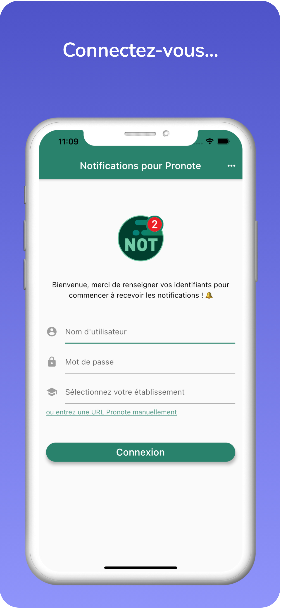
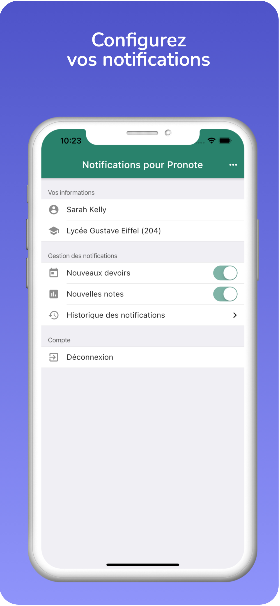
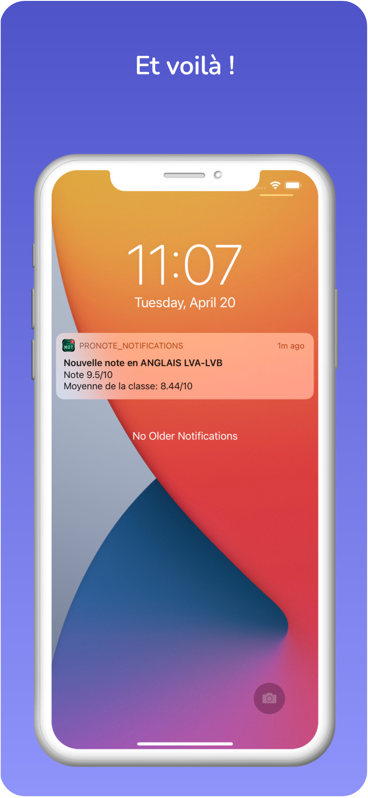

# [🔔 Notifications pour Pronote](https://play.google.com/store/apps/details?id=com.androz2091.pronote_notifications&gl=FR)

## PROJET ABANDONNÉ

Ce projet est désormais archivé. Il est tout à fait possible de le lancer de nouveau sur votre propre serveur mais il ne sera plus disponible en ligne et sur les stores à compter de juillet 2021, pour les raisons suivantes :
* bans réguliers de la part de Pronote (ban de l'IP de l'API, et non pas des comptes, ce n'est donc pas risqué pour les utilisateurs, et tout à fait bypassable par des proxies - simplement cela demande du temps).
* manque de temps des maintainers (Notif. pour Pronote est maintenue par Androz et certains membres de l'équipe de EduWireApps, qui ne sont plus disponibles).
* quelques coups de pression de la part de Pronote pour supprimer l'appli (ils n'ont théoriquement aucune raison suffisante de faire l'effort de porter plainte, mais nous n'avons pas de temps à perdre avec ça si un tel évènement devait arriver). Cf message de Pronote (que nous avons gentiment ignoré pendant des mois pour vous permettre de continuer à bénéficier de l'appli :)

Notifications pour Pronote est une application mobile qui étend les fonctionnalités de l'application [Pronote](https:/https://play.google.com/store/apps/details?id=com.IndexEducation.Pronote) en envoyant des notifications lors de l'ajout d'un devoir ou d'une note.

## Téléchargement

## Fonctionnalités

* Envoi de notifications lorsqu'un devoir est ajouté sur Pronote
* Envoi de notifications lorsqu'une note est ajoutée sur Pronote
* Support de tous les collèges et lycées utilisant Pronote

### Prévues

* Envoi de notifications lorsqu'un cours des deux prochaines semaines est annulé
* Envoi de notifications lorsque la salle d'un cours des deux prochaines semaines est modifiée
* Ajout d'un bouton `Supprimer mes données`

## Screenshots

    
    
    

## Fonctionnement

Pronote ne disposant pas d'API, le seul moyen de détecter des ajouts de devoirs/notes/... est de se connecter à un interval de temps régulier et de comparer le résultat avec le précédent, ce qui est effectué par [l'API de l'application](https://github.com/pronote-notifications/pronote-notifications-api). Pour cela, l'API doit disposer au préalable des identifiants des utilisateurs et les mots de passes sont donc stockés par l'API pour se connecter automatiquement. Un bouton pour supprimer les données est prévu mais n'est pas encore disponible. Si vous souhaitez que vos données soient supprimées, vous pouvez m'envoyer un mail (`androz2091@gmail.com`).

Le code est entièrement open source :

* [repository de l'application mobile](https://github.com/pronote-notifications/pronote-notifications-app)
* [repository de l'API de l'application](https://github.com/pronote-notifications/pronote-notifications-api)

## Build

* Installer le SDK flutter.
* Construire l'application : `flutter build apk --split-per-abi --no-sound-null-safety`.
* Tester l'application : `flutter run`.

### Made with

<code></code> **Flutter** (front-end)  
<code></code> **Node.js** (back-end)  
<code></code> **PostgreSQL** (base de données)  
<code></code> **Firebase** (notifications)  
